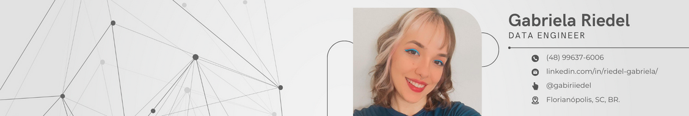

<head>FuturoDEV - Módulo 2</head>
<h1>Projeto LabFood Frontend</h1>

> Olá! Bem vindo ao repositório do projeto LabFood. Este repositório é referente ao projeto final do curso FuturoDEV do SENAI-SC em parceria com a Prefeitura de Florianópolis. É a criação de um front-end de um sistema decaderno de receitas pessoal na linguagem Javascript, desenvolvido com a biblioteca React + Vite e utilizando localstorage como .

## 💻 Pré-requisitos

:white_check_mark: Requisito geral da aplicação:

- A aplicação que deverá ser realizada individualmente, deve ser desenvolvida utilizando React e contemplar os seguintes requisitos:
    - Um título na aba do navegador, para que o usuário encontre a sua aplicação no meio das várias abas que constantemente mantém abertas.
    - Um cabeçalho dentro da página, para que o usuário saiba facilmente em que página se encontra e do que se trata o conteúdo.
    - Três campos de seleção no para que o usuário escolha filtrar receitas por “Sem derivados de leite”, “Sem Glúten” e “Todas”
    - Um botão para filtrar as receitas.
    - Um botão para adicionar uma nova receita. Quando pressionado o + a aplicação deve apresentar um pop-up para cadastro de uma nova receita, com os seguintes campos:
        - Nome
        - Ingredientes
        - Modo de Preparo
        - Restrições (Lactose ou Glúten)
     - O usuário poderá editar as informações da receita ou excluí-la. Quando o usuário pressionar a ! a aplicação deve apresentar um pop-up contendo as informações da receita e dois botões: Alterar ou Excluir.
     - A lista deve ser salva no localStorage do navegador (incluindo as receitas que já foram excluídas), e deve ser carregada sempre que a página for reaberta.

## 🤝 Colaboradores

Agradeço aos professores Rosana e Carlos por todos os conhecimentos adquiridos até aqui.

<table>
  <tr>
    <td align="center">
      <a href="#">
         
        
          <b>Prof. Rosana Rezende</b>
        
      </a>
    </td>
    <td align="center">
      <a href="#">
         
        
          <b>Prof. Carlos Gabriel Campo</b>
        
      </a>
    </td>
    <td align="center">
      <a href="#">
         
        
          <b>Gabriela Riedel</b>
        
      </a>
    </td>
  </tr>
</table>

[⬆ Voltar ao topo](#FuturoDEV) 

